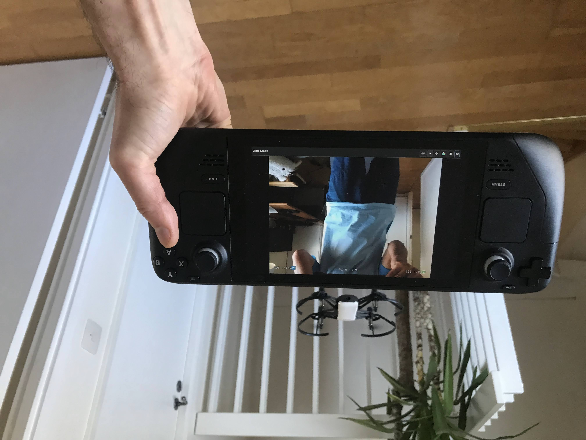

# Tello-Deck

Make your Steam Deck as a controller for DJI Tello drone.

This project uses:
* GTK-3 for the application GUI.
* GStreamer framework with plug-ins for displaying video output and data from the drone.
* ffmpeg to record and save the video output into a file.

Big shout out to Suphi and his project https://gitlab.com/Suphi/Tello as it was largely used as basis for this app.

## Controls

- <kbd>☰</kbd> = Takeoff/Land
- <kbd>⧉</kbd> = Start/Stop Recording Camera
- <kbd>Ⓐ</kbd> = High/Low speed mode
- <kbd>Ⓑ</kbd> = Camera Mode
- <kbd>Ⓧ</kbd> = None
- <kbd>Ⓨ</kbd> = Scan for Gamepad



***
### Installation
```bash
make install
```
tello is installed into /usr/local by default this can be changed by setting DESTDIR.
```bash 
make DESTDIR=/usr install
```
***
### Removal
```bash
make uninstall
```

### Running in Gaming Mode
If you want to run the app in Gaming Mode mode go to `/usr/local/bin/` (or the folder where the app is installed) in Dolphin, select `tello` executable, right click on the file and select "Add to Steam" menu item.
***

## Building on SteamDeck
***
### Disable read-only mode
By default SteamDeck's root file system is read-only so after you create root credentials you have to disable it by running
```bash
sudo steamos-readonly disable
```
or
```bash
sudo btrfs property set -ts / ro false
```
### Installing development tools
Then you have to install `gcc` and `pkg-config`.
```bash
sudo pacman -S gcc pkg-config
```

### Install dependencies and libraries
Install `linux-headers`
```bash
sudo pacman -S glibc linux-api-headers
```
Install `gstreamer` and the `plug-ins`
```bash
sudo pacman -S gstreamer gst-plugins-base gst-plugins-base-lib gst-plugins-good gst-libav
```
Install libs needed for overlays
```bash
sudo pacman -S cairo pango harfbuzz gdk-pixbuf2 
```
Install X Window related libraries
```bash
sudo pacman -S xorgproto libx11 at-spi2-core 
```
### For further development
To support network management capabilities and be able to automatically join Tello's Wi-fi network we will need `libnm` and `glib2`
```bash
sudo pacman -S libnm glib2
```

***