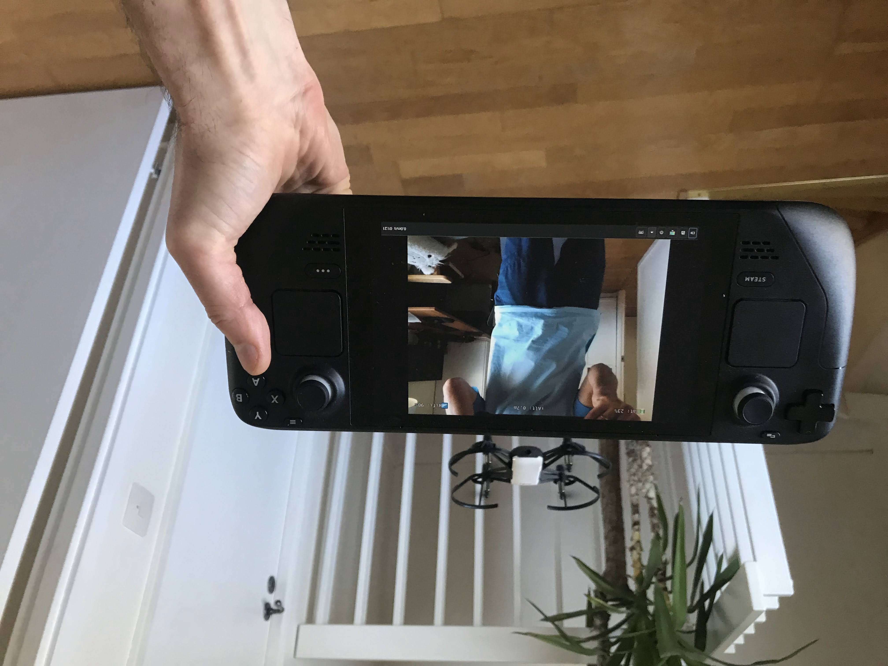

# Tello-Deck

Transform your Steam Deck into a controller for the DJI Tello drone.

This project incorporates:
* GTK-3 for the GUI.
* GStreamer framework and plug-ins for video and data streaming.
* SDL2 for Steam Input-compatible controller discovery and hot-plugging.
* ffmpeg for recording and saving video.

Special thanks to Suphi and his project (https://gitlab.com/Suphi/Tello) for providing the foundation for this app.

## Controls

- <kbd>☰</kbd>: Takeoff/Land
- <kbd>⧉</kbd>: Start/Stop Recording
- <kbd>Ⓐ</kbd>: Toggle Speed Mode
- <kbd>Ⓑ</kbd>: Camera Mode
- <kbd>Ⓧ</kbd>: Save Return Position
- <kbd>Ⓨ</kbd>: Toggle Return Mode
- <kbd>F11</kbd>: Toggle Fullscreen


## Installation
```bash
make install
```
tello is installed into `/usr/local` by default. This can be changed by setting
`PREFIX`.
```bash 
make PREFIX=/usr install
```

## Development container

Open the repository in its devcontainer and let the post-create step finish.
The container is based on the Freedesktop 24.08 SDK used by the Flatpak
manifest, and it installs the matching Platform and SDK into a persistent named
volume.

Build the application directly against the SDK:

```bash
make
```

Build the complete Flatpak in Flatpak's SDK sandbox:

```bash
make flatpak
```

To install and run the development build:

```bash
make flatpak-install
make flatpak-run
```

## Flatpak on SteamOS

Flatpak is the recommended installation method on SteamOS. The Flatpak contains
the application, SDL2, and FFmpeg, while GTK, GStreamer, Cairo, Pango, HarfBuzz and
GDK-Pixbuf are supplied by the pinned GNOME runtime. It does not require
disabling SteamOS read-only mode or installing these libraries with `pacman`.

Build and install it from the repository in Desktop Mode:

```bash
flatpak-builder --user --install --force-clean \
  --install-deps-from=flathub build-dir io.github.mrzinger.TelloDeck.yml
flatpak run io.github.mrzinger.TelloDeck
```

The first command installs the required GNOME runtime automatically. Tello Deck
needs network access for the drone's UDP connection, device access for SDL
controller input, and access to the Videos directory for recordings. It uses
native Wayland when available and falls back to XWayland.

After installation, add the **Tello Deck** application to Steam as a non-Steam
game to launch it from Gaming Mode.

### Removal
```bash
make uninstall
```

### Running in Gaming Mode
To run in Gaming Mode, navigate to /usr/local/bin/ (or installation directory) in Dolphin, right-click the tello executable, and select "Add to Steam".

## Building on SteamDeck
### Disable read-only mode
By default SteamDeck's root file system is read-only so after you create root credentials you have to disable it:
```bash
sudo steamos-readonly disable
```
or
```bash
sudo btrfs property set -ts / ro false
```
### Installing development tools
Install `gcc`, `pkg-config`, and SDL2:
```bash
sudo pacman -S gcc pkg-config sdl2
```

### Install dependencies and libraries
Install essential libraries and dependencies for development:
Install `linux-headers`
```bash
sudo pacman -S glibc linux-api-headers
```
Install `gstreamer` and the `plug-ins`
```bash
sudo pacman -S gstreamer gst-plugins-base gst-plugins-base-libs gst-plugins-good gst-libav
```
Install libs needed for overlays
```bash
sudo pacman -S cairo pango harfbuzz gdk-pixbuf2 
```
Install GTK 3 and its accessibility libraries
```bash
sudo pacman -S gtk3 at-spi2-core
```
### For further development
To support network management capabilities and be able to automatically join Tello's Wi-fi network we will need `libnm` and `glib2`
```bash
sudo pacman -S libnm glib2
```
